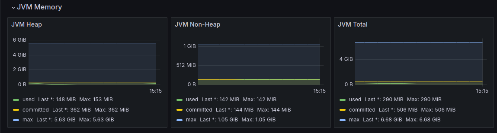

Для запуска приложения необходимо сначала
поднять docker-compose, после запусть сервис 
EurekaServiceApplication, а затем
EmployeeService и DepartmentService.

localhost:8080/swagger-ui/index.html - тестирования сервиса отделов через Swagger-UI
localhost:8081/swagger-ui/index.html - тестирование сервиса сотрудников

*** 
### Сборка приложения
#### Для отделов: 

в department-service запустить <code>mvn clean install</code>

#### Для работников

в employee-service запустить <code>mvn clean install</code>

***
Для проверки Jacoco можно увеличить параметр <code>jacoco-coverage-ratio</code> в pom.xml файлке
нужного модуля

***
### Проверка метрик через Grafana

localhost:3000 - подключение к Grafana. Логин и пароль - admin.

В файле config/prometheus/prometheus.yaml в <code>targets</code> на месте хоста нужно указать локальный IP.

Для визуализации метрик JVM и CPU использовался готовый дашборд: https://github.com/IlyushaShulenin/dashboard.git

#### Отчеты по собранным метрикам

Использование CPU

JVM

Работа GC

Время выполнение запроса по добавлению новго сотрудника в миллисекундах

